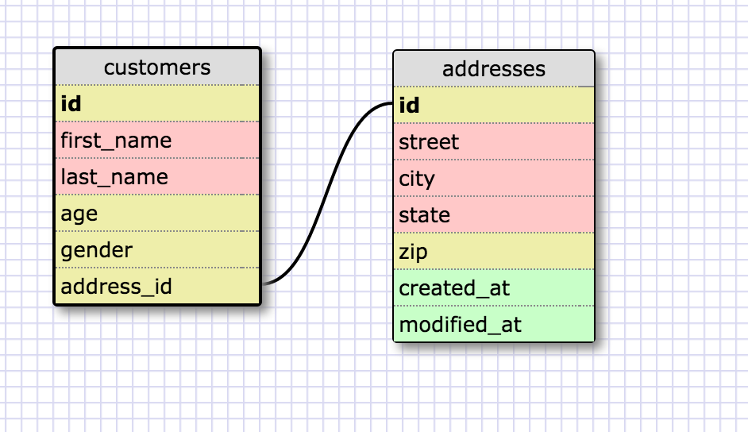
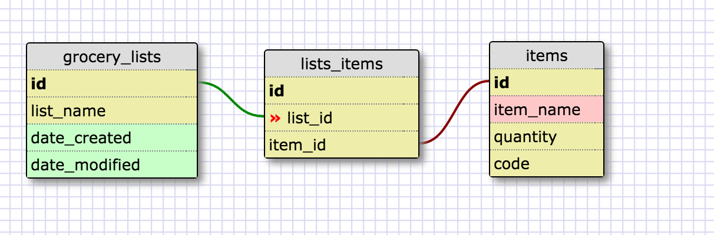

##Release 2

This is a one to one relationship because an address can only belong to one customer. Technically two people in the same house could be different customers in some realm. But we'll assume not here.

##Release 3

##Reflections

###What is a one-to-one database?
It is a database with tables that have one direct link, meaning one row can only be linked to one row in another table.

###When would you use a one-to-one database? (Think generally, not in terms of the example you created).
When one row in one table would necessarily be connect only to one row in another table.

###What is a many-to-many database?
It is when multiple rows can be connected to multiple rows in another table.

###When would you use a many-to-many database? (Think generally, not in terms of the example you created).
When you were trying to link mulitple rows on one table to multiple rows on another.

###What is confusing about database schemas? What makes sense?
The complex relationships can get confusing, but it is clear that at times you want to seperate data into different tables and then relate them together, which keeps individual tables clear and concise.